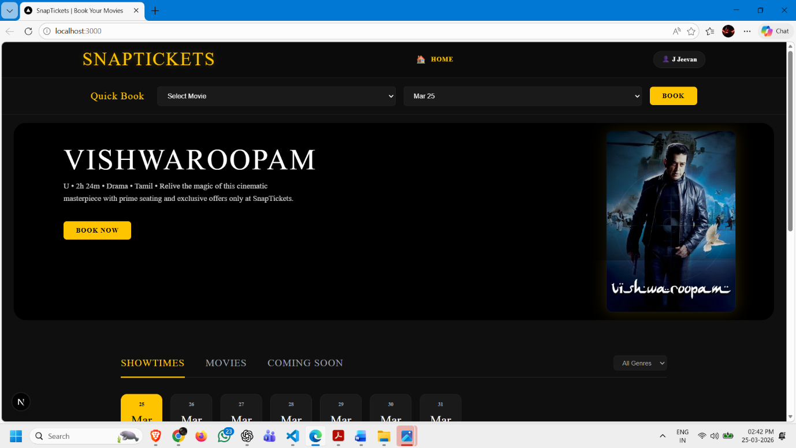

# <p align="center">🎟️ SnapTicket - Premium Cinema Experience</p>

<p align="center">
  
</p>

<p align="center">
  <a href="https://snapticket.vercel.app/">
    
  </a>
  
  
</p>

---

## 📸 App Preview

<p align="center">
  
</p>

> **Note:** Above is the cinematic hero section featuring high-quality posters and a seamless booking interface.

---

## <font color="#ffc400">✨ Core Features</font>

### 🎬 Real-time Movie Discovery
*   **Live Sync:** Movie data fetched directly from Supabase.
*   **Dynamic Posters:** High-resolution assets pulled via TMDB API.

### 💺 Advanced Seat Engine
*   **Interactive Mapping:** Visual grid with multi-tier pricing (**Prime** & **Classic**).
*   **Occupancy Control:** Real-time seat status updates and double-booking prevention.

### 👤 Frictionless UX
*   **Rapid Checkout:** Persistent user profiles stored in `localStorage`.
*   **Instant Receipts:** Automatic booking ID generation and digital receipt views.
*   **Mobile-First:** Fully responsive design for all devices.

---

## <font color="#3ECF8E">🛠️ Technical Excellence</font>

| Layer | Technology |
| :--- | :--- |
| **Framework** | Next.js 15 (App Router) |
| **Database** | Supabase (Postgres) |
| **Styling** | Vanilla CSS (Modern CSS Modules) |
| **API** | TMDB (The Movie Database) |
| **Auth/State** | LocalStorage & Server Actions |

---

## 🚀 Quick Start

1. **Clone & Install**
   ```bash
   git clone https://github.com/JJ2025-1/snapticket.git
   npm install
   ```

2. **Environment Setup**
   Create `.env.local`:
   ```env
   NEXT_PUBLIC_SUPABASE_URL=your_url
   NEXT_PUBLIC_SUPABASE_ANON_KEY=your_key
   TMDB_TOKEN=your_token
   ```

3. **Launch**
   ```bash
   npm run dev
   ```

---

<p align="center">
  <b>Built with ❤️ for the Global Cinema Community.</b><br>
  <i>Empowering movie buffs with a "snap" booking experience.</i>
</p>
